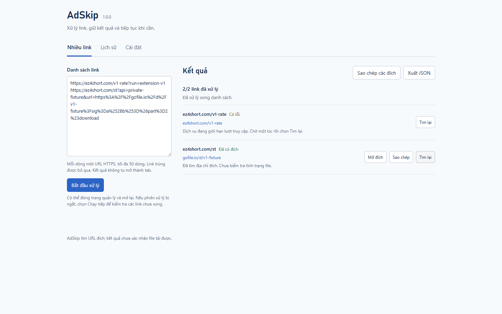
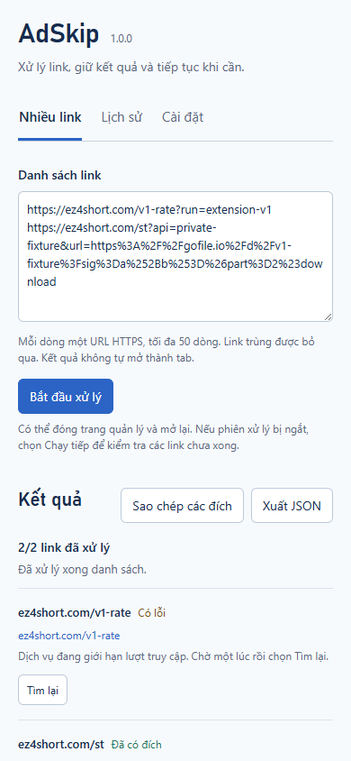
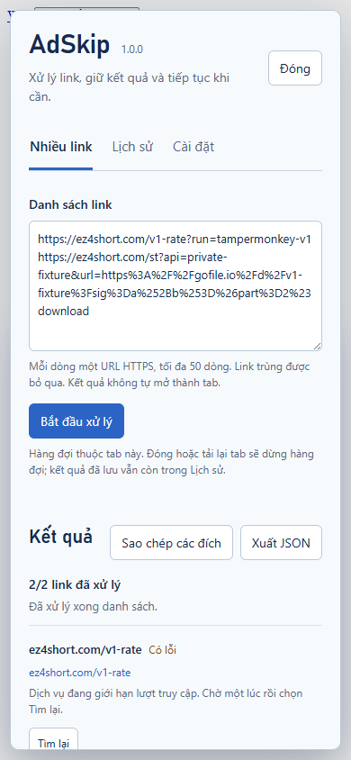

# Kiểm thử AdSkip 1.0.0

Ngày chạy: **09/10/2026**. Node **24.21.0**, Playwright **1.62.1**, Chromium **151.0.7922.34**, Tampermonkey chính thức **5.4.1**. Profile QA riêng, không dùng dữ liệu trình duyệt cá nhân.

## Kết quả

| Lệnh | Kết quả | Phạm vi đã thực hiện |
| --- | --- | --- |
| `npm run build` | PASS | Cú pháp JS, version core/package/manifest, bundle userscript và module extension/rulesets |
| `npm test` | **79/79 PASS** | Core 18, resolver 17, background 19, transport 4, ads 7, library 6, batch 8 |
| `npm run test:extension:v1` | **16 nhóm PASS** | Options UI thật, Chrome APIs/storage/clipboard/download, HTTPS fixture, batch và browser restart |
| `npm run test:tampermonkey` | **24 nhóm PASS** | Bundle cài qua editor thật, GM APIs, luồng 0.3 và manager 1.0, ghi đồng thời từ hai tab |
| `npm run test:browser` | 7 nhóm PASS | Widget userscript với GM shim/network fixture; không phải manager thật |
| `npm run test:extension` | 7 nhóm PASS | Extension thật, fixture network, trạng thái theo tab và tự mở |
| `npm run test:extension:v02` | 10 nhóm PASS | Popup dán link/khôi phục/tiếp tục, HTTPS fixture thật |
| `npm run test:extension:v03` | 11 nhóm PASS | DNR thật, alias/DOM mới, phạm vi bộ lọc và browser restart |
| `npm run test:worker` | 3 nhóm PASS | CDP dừng worker thật, trạng thái ngắt đã gieo, retry popup |
| `npm run test:live` | PASS | Link được cung cấp, giải mã full-pages cục bộ, 0 request resolver |
| `npm run test:live-extension` | 3 nhóm PASS | Trang thật/popup thật, DNR phát hành, 0 page errors |
| `npm run test:live:tampermonkey` | 3 nhóm PASS | Script cài thật trong profile mới, trang thật/GM APIs, 0 page errors; harness chặn quảng cáo/media bên thứ ba |

JSON kết quả nằm trong [evidence/v1](evidence/v1/). Các “nhóm” là checkpoint của suite trình duyệt, không phải số test case Node độc lập.

## Chức năng 1.0 được kiểm tra

| Chức năng | Bằng chứng |
| --- | --- |
| Mở manager | Popup mở options page bằng API native; widget mở lại manager extension; widget Tampermonkey mở native dialog |
| Danh sách hỗn hợp | Full-pages, `/st`, EZ4 alias đã cấp đích, alias thủ công, 404, dòng không hợp lệ và URL trùng |
| Giới hạn và tốc độ | 51 dòng bị từ chối, kết quả cũ giữ lại; đúng 3 GET cho các alias, thời gian request liên tiếp ít nhất 450 ms khi cài 500 ms |
| Dừng/Chạy tiếp | Hủy transport đang chạy, phản hồi đến muộn không đổi hàng đợi, link tiếp theo không được request; Resume xử lý tiếp |
| HTTP 429 | Dòng lỗi giữ nguyên, hàng đợi tạm dừng; Resume chạy dòng còn chờ, không tự retry dòng bị giới hạn |
| Retry từng dòng | Chỉ chạy dòng được chọn, kết quả các dòng khác giữ lại |
| Thủ công extension | Continue trước khi mở tab báo hướng dẫn; mở đúng tab, thao tác bật nút, đọc DOM mới, không GET lại |
| Worker restart | CDP dừng worker thật; batch session được gieo có một dòng xong/một dòng đang xử lý; mở lại giữ đích đã xong, đánh dấu dòng chưa xong và Resume |
| Đóng/mở | Đóng/mở trang quản lý extension vẫn có batch; đóng/mở hộp thoại Tampermonkey vẫn có batch; tải lại tab Tampermonkey mất queue, còn history/settings |
| Lịch sử | Nhãn nguồn che query/payload, giữ URL đích đầy đủ; tìm/lọc/xóa từng dòng/xóa toàn bộ và tắt ghi mới |
| Hai tab GM | Hai sandbox thật hoàn tất đồng thời; cả hai record tồn tại và manager đang mở được cập nhật qua listener |
| Clipboard và file | Clipboard hệ thống giữ query/chữ ký/fragment; tải JSON batch/lịch sử thật, không chứa link nguồn/API key fixture, manual/error có URL null |
| Mở đích | Nút mở lịch sử tạo tab đích thật qua Chrome API/GM_openInTab, URL giữ đầy đủ |
| Cài đặt | Delay/retention/save-history lưu được; tùy chọn quảng cáo từ 0.3 giữ nguyên; browser restart extension giữ history/settings |
| UI | Manager 1440×900 và 390×844 không tràn ngang; phím mũi tên/Home/End chọn tab; popup hồi quy ở 320/360 px |

Unit kiểm tra thêm retention/prune đến 250 record, dữ liệu hỏng, lỗi lưu lịch sử không làm mất đích, lỗi cài đặt, giới hạn request và race khi Dừng/job mới. Các lỗi lưu/quota và prune 250 được mô phỏng bằng storage adapter, chưa gây đầy kho Chrome/GM thật.

## Link người dùng và quảng cáo

Link đã cung cấp cho đích [Gofile](https://gofile.io/d/PKvjP6Yd) qua extension và Tampermonkey 1.0. Lượt extension dùng DNR phát hành, không Playwright route interception/host mapping/bỏ xác minh TLS. Script của `3nbf4.com` và `forfrogadiertor.com` bị chặn; 0 lỗi trang.

Lượt Tampermonkey trang thật dùng harness chặn quảng cáo/media bên thứ ba, nên kết quả này xác nhận giải link với GM thật. Suite HTTPS fixture riêng xác nhận userscript **ẩn** khung quảng cáo, request quảng cáo vẫn tới server và khung xác minh giữ hiển thị.

Đây là kiểm tra URL đích; chưa tải file hay xác nhận file còn khả dụng. Không có alias EZ4Short thật được cung cấp; kiểm tra alias/manual/429 của manager dùng fixture.

## Ảnh giao diện







Ảnh Lịch sử/Cài đặt và trang thật cũng có trong [screenshots](screenshots/). Các ảnh manager dùng dữ liệu fixture, không API key thật.

## Phân phối và giới hạn

Gói: `dist/AdSkip-1.0.0.zip`; tạo bằng `scripts/package.ps1`, kiểm tra bằng `scripts/verify-package.ps1`. Checksum SHA256 và kết quả kiểm tra gói nằm trong `dist/SHA256SUMS-1.0.0.txt` và `dist/package-check-result.json` bên ngoài ZIP. Verifier kiểm tra version, 10 bản sao module, 3 ruleset có phạm vi, options page, loại thư mục riêng/cache/TLS key và quét API key thật trong các tệp văn bản.

- Chưa chạy Chrome/Edge cá nhân, Firefox, điện thoại vật lý hoặc layout ở mọi kích thước. 390 px là viewport Chromium desktop thu nhỏ.
- Worker restart dùng trạng thái ngắt gieo sẵn; chưa cưỡng bức đóng worker đúng lúc batch request đang chạy trên trang thật.
- Browser restart persistence được kiểm tra trên extension; userscript persistence kiểm tra qua tải lại trang và nhiều tab, chưa restart browser trong suite GM.
- Metadata cập nhật script có trong bundle; chưa xác nhận lần cài bằng URL từ GitHub hoặc bộ hẹn giờ cập nhật tự động. Suite cài qua editor.
- Chưa chạy tải dài ngày/50 URL thật, CAPTCHA thật hoặc backend dịch vụ thay đổi. Một batch có thể cần thao tác thủ công/phiên hợp lệ.
- GM không có transaction đa tab. Ghi hai kết quả đồng thời đã qua kiểm tra; Clear/prune đồng thời với các tab đang xử lý không bảo đảm snapshot nguyên tử.
- ZIP cài cục bộ, chưa xuất bản Chrome Web Store/Edge Add-ons.

## Chạy lại

```powershell
npm ci
npm run build
npm test
npm run test:extension:v1
# ADSKIP_TAMPERMONKEY_PATH trỏ tới gói chính thức đã giải nén
npm run test:tampermonkey
.\scripts\package.ps1
.\scripts\verify-package.ps1
```

Fixture HTTPS cần OpenSSL; có thể đặt `ADSKIP_OPENSSL_PATH`. Browser riêng có thể chọn qua `ADSKIP_BROWSER_PATH`. Link thật truyền bằng `ADSKIP_LIVE_URL`; không đưa input có API key vào báo cáo hoặc Git.
